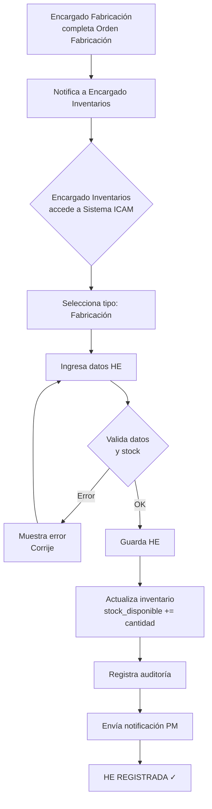

---
## Introducción

Este documento recoge los **13 casos de uso principales** del módulo de **Inventarios** del sistema ICAM. Define explícitamente cómo se gestionan:

- **Solicitudes de Salida (SS)** y **Hojas de Salida (HS)** — entregas de equipo
- **Solicitudes de Entrada (SE)** y **Hojas de Entrada (HE)** — recepciones de equipo
- **Validación de stock**, **actualización de inventario**, **ajustes manuales**
- **Conteos cíclicos**, **conciliaciones** y **auditoría de discrepancias**
- **Reportes operativos** y **análisis de rotación**

**Cada caso de uso incluye:**

- **Objetivo:** qué se logra
- **Precondiciones:** estados/datos que deben existir
- **Responsables:** quién ejecuta cada paso
- **Flujo principal:** pasos detallados
- **Flujo alternativo:** excepciones o variantes
- **Efectos en inventario:** cambios al stock
- **Validaciones críticas:** reglas que deben cumplirse
- **Diagrama:** visualización del flujo

---

## Nota sobre Responsabilidades Clave

**El Revisor de Contratos** genera:

- **Solicitud de Salida (SS):** autorización de entrega (vinculada a contrato)
- **Solicitud de Entrada (SE):** solicitud de recolección (vinculada a contrato)
- **HS y HE automáticas:** solo en casos **Venta por Pérdida**, **Venta por Solicitud del Cliente** y **Cancelación Expresa**

**El Encargado de Inventarios** es el **ÚNICO autorizado** para:

- Crear, validar y ejecutar **Hojas de Salida (HS)** — descuenta inventario
- Crear, validar y ejecutar **Hojas de Entrada (HE)** — incrementa inventario
- Validar **stock disponible** antes de autorizar salidas
- Registrar **ajustes manuales** (requiere aprobación PM si > 5% del SKU)
- Generar **reportes semanales** de movimientos, stock y discrepancias

**El PM de Inventarios** (Gustavo):

- Aprueba **ajustes manuales > 5%** del stock total del SKU
- Autoriza **HS y HE de tipo "ajuste"**
- Recibe **reportes semanales** y supervisa operación
- Realiza **conteos cíclicos** con Logística

---

## CASO 1: Recepción de Equipo por Fabricación (HE desde Orden de Fabricación)

### Objetivo

Registrar la entrada de equipo fabricado internamente al inventario, vinculado a una Orden de Fabricación.

### Precondiciones

- Existe una Orden de Fabricación (OF-XXXX) generada y autorizada
- Equipo ha sido fabricado y está listo para recibir
- El catálogo de productos (SKUs) está actualizado
- Encargado de Fabricación ha confirmado la cantidad y calidad

### Responsables Principales

- **Encargado de Fabricación:** informa equipo fabricado con cantidad y características
- **Encargado de Inventarios:** valida, recibe físicamente y registra HE
- **Encargado de Logística:** apoya en traslado del equipo al almacén (opcional)

### Flujo Principal

1. **Encargado de Fabricación** completa la Orden de Fabricación (OF-XXXX) y notifica al Encargado de Inventarios que el equipo está listo.
    
    - Información incluida: SKU(s), cantidad, características, peso unitario, fecha de fabricación.
2. **Encargado de Inventarios** accede al panel "Crear HE" en Sistema ICAM.
    
    - Selecciona tipo de movimiento: **"Fabricación"**
    - Selecciona folio de referencia: **Orden de Fabricación (OF-XXXX)**
3. **Encargado de Inventarios** ingresa los datos de la HE:
    
    - **Folio HE:** generado automáticamente (HE-XXXX o secuencia)
    - **Fecha de entrada:** hoy (YYYY-MM-DD HH:MM)
    - **Tipo de movimiento:** "Fabricación"
    - **Folio de referencia:** OF-XXXX
    - **Items:** selecciona SKU(s) del catálogo
    - **Cantidad:** cantidad real recibida
    - **Peso unitario:** tomado del SKU o especificado
    - **Peso total:** calculado (cantidad × peso unitario)
    - **Observaciones:** si aplica (ej: "Lote A123", "Acabado especial", etc.)
    - **Chofer/Responsable:** nombre de quien traslada (opcional)
4. **Encargado de Inventarios** valida que:
    
    - SKU existe en catálogo
    - Cantidad > 0
    - OF-XXXX es válida
    - Folio HE es único
5. **Encargado de Inventarios** guarda la HE:
    
    - Sistema crea registro en tabla `ops_he` (campo `tipo_movimiento = 'fabricacion'`)
    - Sistema crea registros en tabla `ops_he_items` (uno por SKU)
    - **Inventario se actualiza INMEDIATAMENTE:**
        - `inventario.stock_disponible += cantidad` (para cada SKU)
        - `inventario.stock_total += cantidad`
    - HE queda con estado **"REGISTRADA"**
6. **Sistema registra auditoría:**
    
    - Usuario: quién creó
    - Fecha/hora: cuándo
    - Folio HE
    - Cambios al inventario
7. **Notificación automática** (si está configurada):
    
    - Correo al PM con resumen: "HE-XXXX registrada | Fabricación | SKUs | Cantidad"

### Flujo Alternativo A: Discrepancia de cantidad (llegó menos de lo esperado)

1. Si la cantidad real < cantidad esperada en OF-XXXX:
2. Encargado documenta la discrepancia en **"Observaciones"** de la HE.
3. Levanta una **Minuta de Discrepancia** (externa, fuera del sistema) con folio MINUTA-XXXX.
4. Registra la HE con la cantidad REAL recibida.
5. Adjunta folio de minuta en campo **"Folio de referencia"** de la HE.
6. Notifica a Encargado de Fabricación para investigación.

### Flujo Alternativo B: Equipo rechazado por calidad

1. Encargado de Fabricación notifica que equipo tiene defecto y no debe entrar al inventario.
2. Encargado de Inventarios **NO crea HE**.
3. Se retorna equipo a Fabricación.
4. Se genera **Acta de Rechazo** (externa) con folio ACTA-REC-XXXX.
5. No hay impacto en Sistema ICAM.

### Efectos en Inventario

- **Stock disponible:** aumenta en cantidad HE
- **Stock total:** aumenta en cantidad HE
- **Estado del SKU:** permanece "disponible"
- **Ubicación:** registrada en almacén (si aplica)

### Validaciones Críticas

```
- OF-XXXX debe existir y estar activa (no cerrada)
- SKU debe existir en catálogo
- Cantidad > 0
- Folio HE es único en el sistema
- Fecha de entrada no puede ser futura
```

### Datos Mínimos Requeridos en HE

| Campo               | Obligatorio | Tipo          | Ejemplo                        |
| ------------------- | ----------- | ------------- | ------------------------------ |
| Folio HE            | Sí          | String        | HE-0001                        |
| Fecha de entrada    | Sí          | DateTime      | 2026-05-22 10:30               |
| Tipo de movimiento  | Sí          | Enum          | "Fabricación"                  |
| Folio de referencia | Sí          | String        | OF-0042                        |
| SKU                 | Sí          | String        | M156-200                       |
| Cantidad            | Sí          | Numeric(10,2) | 5.00                           |
| Peso unitario       | Sí          | Numeric(10,2) | 25.50                          |
| Peso total          | Auto        | Numeric(10,2) | 127.50                         |
| Chofer/Responsable  | No          | String        | "Juan Pérez"                   |
| Observaciones       | No          | Text          | "Lote fabricado en 2026-05-20" |

### Diagrama de Flujo



---


## CASO 2: Recepción de Equipo por Compra a Proveedores (HE desde OC)

### Objetivo

Registrar la entrada de equipo comprado a proveedores externos, vinculado a OC.

### Precondiciones

- Orden de Compra (OC-XXXX) creada, autorizada y enviada
- Equipo recibido en almacén
- Remisión/factura del proveedor disponible
- Catálogo actualizado

### Responsables

- **Encargado Logística:** recibe físicamente
- **Encargado Inventarios:** valida y registra HE
- **PM:** supervisa entregas > 20 unidades

### Flujo Principal

1. Encargado Logística recibe equipo del proveedor con remisión
2. Valida datos vs. OC (cantidad, SKUs)
3. Si hay discrepancias: notifica inmediatamente
4. Traslada equipo al almacén
5. Encargado Inventarios accede a "Crear HE" en Sistema ICAM
    - Tipo movimiento: "Compra"
    - Folio referencia: OC-XXXX
6. Ingresa datos:
    - Folio HE, fecha, cliente/proveedor
    - Items, cantidades, peso
    - Observaciones: número remisión, condiciones
7. Valida:
    - OC existe y está activa
    - SKU(s) existen
    - Cantidad > 0
    - Folio HE único
8. Guarda HE:
    - Crea registro ops_he (tipo='compra')
    - **Actualiza inventario:** stock_disponible += cantidad, stock_total += cantidad
    - Estado: "REGISTRADA"
9. Si cantidad real ≠ cantidad OC:
    - Documenta en observaciones
    - Crea Minuta de Diferencia (MINUTA-XXXX) externa
    - Adjunta folio minuta a HE
    - Notifica a Encargado Compras y Proveedor
10. Notificación automática al PM

### Flujos Alternativos

**A: Cantidad menor (corto en cantidad)**

- Registra HE con cantidad REAL
- Documenta: "Entrega parcial. Pendiente X unidades"
- Levanta Minuta
- Notifica a Compras para gestionar devolución/crédito

**B: Cantidad mayor (sobre-entrega)**

- Documenta anomalía
- Levanta Minuta explicando sobre-entrega
- Consulta con PM/Compras: ¿aceptar o devolver?
- Si acepta: registra HE con cantidad REAL
- Si rechaza: NO crea HE, coordina devolución

**C: Equipo dañado en tránsito**

- Logística reporta daño en descarga
- Levanta Acta de Daño (ACTA-DAÑ-XXXX) con fotos
- Notifica Proveedor para reclamación
- Si daño total: NO crea HE
- Si daño parcial: registra HE solo con cantidad EN BUEN ESTADO

### Efectos en Inventario

- Stock disponible: +X
- Stock total: +X

### Validaciones Críticas

```
- OC-XXXX existe y activa
- SKU(s) existen
- Cantidad > 0
- Folio HE único
- Remisión disponible para auditoría
```

---

## CASO 3: Recepción de Equipo por Subarrendamiento (HE desde Contrato)

### Objetivo

Registrar entrada de equipo subarrendado (ICAM renta de tercero para subrentar a clientes).

### Precondiciones

- Contrato Subarrendamiento (ej. CON-SUB-XXXX) con tercero
- Equipo recibido físicamente en almacén
- Especificaciones (SKU, cantidad, características) definidas

### Flujo Principal

1. Subarrendador entrega equipo a almacén con remisión
2. Encargado Logística recibe y notifica Inventarios
3. Encargado Inventarios accede "Crear HE"
    - Tipo: "Subarrendamiento"
    - Folio referencia: CON-SUB-XXXX
4. Ingresa datos:
    - Folio HE, fecha, proveedor (subarrendador)
    - Items, cantidades, peso
    - Observaciones: condiciones, período subarrendamiento
5. Valida:
    - CON-SUB-XXXX existe y activo
    - SKU(s) existen
    - Cantidad > 0
    - Folio HE único
6. Guarda HE:
    - Crea ops_he (tipo='subarrendamiento')
    - **Actualiza:** stock_disponible += cantidad, stock_total += cantidad
    - Estado: "REGISTRADA"
7. Notificación al PM: "HE-XXXX registrada. Disponible para distribución"


### Efectos en Inventario

- Stock disponible: +X
- Stock total: +X
- Estado: "disponible para renta"

---

## CASO 4: Salida de Equipo por Renta (HS desde SS)

### Objetivo

Registrar salida de equipo rentado desde almacén hacia cliente, validando stock.

### Precondiciones

- Contrato Renta (C-XXXX) creado y autorizado
- Revisor generó SS con autorización de entrega
- Equipo disponible en almacén (stock > 0)
- Logística coordinada para transporte

### Flujo Principal

1. Revisor Contratos genera SS (folio SS-XXXX)
    - Vinculada a CON-XXXX
    - Items, cantidades
    - Estado: "PENDIENTE"
    - **NO afecta inventario aún**
2. Encargado Inventarios recibe notificación de SS pendiente
    - Revisa en panel "HS - Hojas de Salida"
    - Filtra SS pendientes o crea HS directamente
3. Encargado valida stock disponible:
    - Consulta stock_disponible para cada SKU en SS
    - Sistema muestra: stock_disp | cantidad_contrato | ya_entregado | pendiente
    - Ejemplo:

```
     SKU M156-200: stock_disp=25 | cantidad_contrato=20 | ya_entregado=10 | pendiente=10
     ✓ DISPONIBLE (25 >= 10)
```

4. **Si stock INSUFICIENTE:** **Caso A: SKU se fabrica internamente**
    
    - Sistema detecta: se_fabrica = true
    - Genera Solicitud Fabricación (PDF): SOL-FAB-XXXX
    - Notifica Fabricación
    - HS queda PENDIENTE DE STOCK
    
    **Caso B: SKU se subarrienda**
    
    - Sistema detecta: se_subarrenda = true
    - Genera Solicitud Subarrendamiento: SOL-SUB-XXXX
    - Notifica Contratos
    - HS queda PENDIENTE DE STOCK
    
    **Caso C: Equipo en mantenimiento**
    - Alerta: "Hay X unidades en mantenimiento. ¿Solicitar mantenimiento urgente?"
    - Encargado decide
5. **Si stock SUFICIENTE:**
    - Accede crear/validar HS
    - Selecciona SS asociada o crea HS directa
    - Ingresa datos:

```
     Folio HS: auto-generado
     Fecha salida: hoy
     Tipo movimiento: "Renta"
     Folio referencia: SS-XXXX
     Cliente: [auto-llena]
     Contrato: CON-XXXX
     Items: SKU(s)
     Cantidad: [puede ser parte de solicitado]
     Peso unitario/total: calculado
     Chofer: nombre transportista
     Observaciones: si aplica
```

6. Valida:
    - SS existe y activa (si aplica)
    - SKU(s) existen
    - Cantidad <= stock_disponible
    - Cantidad <= cantidad_pendiente_contrato
    - Folio HS único
    - Cliente existe
7. Guarda HS:
    - Crea ops_hs (tipo='renta')
    - Si existe SS: SS cambia a "EJECUTADA"
    - **INVENTARIO DESCUENTA:**
        - stock_disponible -= cantidad
        - stock_total se mantiene (equipo en campo, no pérdida)
    - HS estado: "REGISTRADA"
8. Recalcula estatus contrato:
    - total_entregado = suma todas HS del contrato
    - Si total >= cantidad_contratada → contrato "ACTIVO"
    - Si total < cantidad_contratada → contrato "ENTREGA PARCIAL"
9. Auditoría + Notificación PM y Logística

### Flujos Alternativos

**A: HS Parcial (entregar en varias partes)**

- Solicitan 20, entregas 12 ahora
- HS-0050: 12 unidades
- SS permanece ACTIVA (no ejecutada)
- Más adelante: HS-0051: 8 unidades
- Cuando suma = cantidad_solicitada, SS se marca "EJECUTADA"

**B: HS sin SS previa (movimiento especial)**

- Encargado crea HS sin SS
- Sistema alerta: "HS sin SS asociada. ¿Motivo?" (campo obligatorio)
- Encargado documenta: "Cambio de equipo en obra", "Reemplazo por daño", etc.
- HS se registra normalmente

**C: Rechazo de HS (stock insuficiente, cliente rechaza, etc.)**

- Stock disponible < cantidad solicitada
- SS cancelada
- Contrato cancelado
- Sistema **rechaza HS** con error específico
- Encargado NO puede forzar creación

### Efectos en Inventario

- Stock disponible: -X (disminuye)
- Stock total: se mantiene (equipo en renta, no pérdida)

---

## CASO 5: Salida de Equipo por Venta (HS desde SS)

### Objetivo

Registrar salida (venta definitiva) de equipo, descontando inventario permanentemente.

### Precondiciones

- Contrato Venta (CON-XXXX) creado
- Revisor generó SS
- Equipo disponible en almacén
- Cliente confirmó entrega

### Flujo Principal

1. Revisor genera SS (tipo venta)
    - Estado: "PENDIENTE"
2. Encargado Inventarios valida disponibilidad
    - Si insuficiente: sigue protocolo Caso 4 (fabricación/subarrendamiento)
3. Crea HS:
    - Tipo movimiento: "Venta"
    - Folio referencia: SS-XXXX
    - Demás campos: igual Caso 4
4. Guarda HS:
    - Crea ops_hs (tipo='venta')
    - **INVENTARIO DESCUENTA PERMANENTEMENTE:**
        - stock_disponible -= cantidad
        - stock_total -= cantidad ← **DIFERENCIA CON RENTA**
    - SS cambia a "EJECUTADA"
    - HS estado: "REGISTRADA"
5. Estatus contrato:
    - Si total_vendido >= cantidad_contratada → contrato "ENTREGADO" o "CERRADO"
6. Notificación al PM: "HS-XXXX | Venta | CON-XXXX | Cantidad | Stock final"

### Diferencia Crítica vs. Renta

| Aspecto          | Renta                     | Venta                |
| ---------------- | ------------------------- | -------------------- |
| stock_disponible | Disminuye                 | Disminuye            |
| stock_total      | Se mantiene               | **Disminuye**        |
| Equipo en campo  | Rastreado para devolución | Fuera del inventario |
| Retorno esperado | Sí (SE posterior)         | No                   |


### Efectos en Inventario

- Stock disponible: -X
- Stock total: -X (venta permanente)

---

## CASO 6: Recepción de Devolución de Cliente (HE desde SE)

### Objetivo

Registrar entrada de equipo devuelto al final de contrato de renta, reincorporando al inventario.

### Precondiciones

- Contrato Renta activo (CON-XXXX)
- Revisor generó SE (solicitud de devolución)
- Equipo recolectado del cliente
- Equipo en almacén listo para procesar

### Flujo Principal

1. Revisor determina cierre/recolección de contrato
    - Genera SE (folio SE-XXXX)
    - Vinculada a contrato
    - Items, cantidades esperadas
    - Estado: "PENDIENTE"
2. Encargado Logística recolecta equipo del cliente
    - Registra en acta de devolución (externa)
    - Confirma cantidad y condición visual
    - Traslada a almacén
3. Encargado Inventarios recibe notificación
    - Revisa SE en Sistema ICAM
    - Cantidad esperada vs. real
4. Si cantidades coinciden y equipo OK:
    - Accede "Crear HE"
    - Tipo: "Recolección"
    - Folio referencia: SE-XXXX
    - Ingresa datos:

```
     Folio HE, fecha, cliente, contrato
     Items, cantidades
     Observaciones: condición ("limpio", "sucio", etc.)
```

5. Valida:
    - SE-XXXX existe
    - Cantidades consistentes (documenta diferencia si aplica)
    - Folio HE único
6. Guarda HE:
    - Crea ops_he (tipo='recoleccion')
    - **INVENTARIO INCREMENTA:**
        - stock_disponible += cantidad
        - stock_total se mantiene (ya estaba en total)
    - SE cambia a "EJECUTADA"
    - HE estado: "REGISTRADA"
7. Actualiza contrato:
    - Si todas HE cubren cantidad → contrato "RECOLECTADO"
    - Si faltan equipos → contrato en revisión
8. Notificación al PM

### Flujos Alternativos

**A: Cantidad menor (falta equipo)**

- Esperado: 10, Recibido: 8, Faltante: 2
- Documenta en observaciones: "Faltantes: 2"
- Levanta Minuta Faltantes (MINUTA-FAL-XXXX)
- Adjunta folio a HE
- Registra HE con cantidad REAL: 8
- Notifica Revisor: "SE-XXXX parcialmente ejecutada"
- Revisor decide: esperar más devoluciones, generar venta por pérdida, o cerrar

**B: Cantidad mayor (sobre-devolución)**

- Cliente devuelve más de lo rentado
- Documenta anomalía
- Levanta Minuta explicando
- Adjunta a HE
- Registra HE con cantidad REAL
- Notifica Revisor para aclaraciones

**C: Equipo dañado en devolución**

- Encargado detecta daño
- Levanta Acta de Daño en Devolución (ACTA-DAÑ-DEV-XXXX) con fotos
- Consulta con PM/Revisor:
    - Si acepta: registra HE con observación "Daño en devolución"
    - Si rechaza: coordina devolución al cliente

**D: Recepción parcial (cliente devuelve en partes)**

- Cliente devuelve 10, envía solo 5 ahora
- Registra HE con 5 unidades
- SE permanece ACTIVA (no ejecutada)
- Más adelante: cliente devuelve 5 restantes → nueva HE
- Cuando suma HE = cantidad total, SE se marca "EJECUTADA"

### Efectos en Inventario

- Stock disponible: +X
- Stock total: se mantiene o ajusta según condición

---

## CASO 7: Venta por Pérdida (HS + HE Automáticas desde Contratos)

### Objetivo

Registrar automáticamente cuando cliente reporta pérdida de equipo rentado.

### Precondiciones

- Contrato Renta activo (CON-XXXX)
- Cliente reportó pérdida
- Revisor de Contratos genera Contrato Venta por Pérdida

### Flujo Principal

**[Este flujo es iniciado desde módulo Contratos. Sistema ICAM lo ejecuta automáticamente]**

1. Revisor identifica pérdida de cliente
    - Crea nuevo Contrato con tipo='VENTA PÉRDIDA'
    - Vinculado al contrato original
    - Items: equipo perdido con cantidades
2. Sistema (automáticamente) genera:
    - HS automática con folio HSP-{folio_c} (tipo='venta_perdida')
    - HE automática con folio HEP-{folio_c} (tipo='ajuste_pérdida')
3. Efectos en Inventario (simultáneamente):
    - HS automática descuenta: stock_disponible -= cantidad y stock_total -= cantidad
    - HE automática incrementa: stock_disponible += cantidad (ficticia, para cuadrar)
    - **Neto:** stock no cambia, pero queda registro de pérdida con trazabilidad
4. Contrato Venta por Pérdida queda CERRADO
5. Encargado Inventarios recibe notificación:
    - "Venta por Pérdida registrada: HSP-XXXX | HEP-XXXX | CON-X | Cantidad | Cliente"
    - Documenta en reportes

### Efectos en Inventario

- Stock disponible: Sin cambio neto (descuento HS + incremento HE = 0)
- Stock total: Sin cambio neto
- **Trazabilidad:** Quedan registros HSP y HEP para auditoría

---

## CASO 8: Salida por Subarrendamiento (HS desde Contrato)

### Objetivo

Registrar salida de equipo subarrendado (ICAM tiene en stock) hacia cliente final.

### Precondiciones

- HE de Subarrendamiento registrada (Caso 3): equipo en almacén ICAM
- Revisor generó SS para distribución
- Stock disponible > 0 para SKU subarrendado

### Flujo Principal

1. Revisor genera SS para contrato renta
    - Cliente A desea rentar equipo HOR-207 (que ICAM subarrienda)
    - SS-XXXX especifica cantidad y SKU
2. Encargado Inventarios valida stock
    - Stock disponible de M156-200 (subarrendado) >= cantidad solicitada
    - ✓ Disponible
3. Crea HS:
    - Tipo: "Renta" (o "Renta - Subarrendado" si sistema lo distingue)
    - Folio referencia: SS-XXXX
    - Observaciones: "Equipo subarrendado de [Proveedor]"
    - Demás campos: cliente, contrato, items, cantidades
4. Guarda HS:
    - Crea ops_hs
    - **INVENTARIO:**
        - stock_disponible -= cantidad (sale del almacén)
        - stock_total puede mantenerse o disminuir (según política subarrendamiento)
    - SS cambia a "EJECUTADA"
    - HS estado: "REGISTRADA"
5. Logística transporta a cliente
6. Cuando cliente devuelve:
    - Revisor genera SE
    - Encargado registra HE (Caso 6)
    - Equipo retorna a almacén disponible para otro cliente

### Efectos en Inventario

- Stock disponible: -X
- Stock total: Puede mantenerse o disminuir según política

---

## CASO 9: Movimiento Interno Entre Almacenes (HS + HE Vinculadas)

### Objetivo

Registrar trasiego de equipo entre almacenes/sucursales (futuro: múltiples ubicaciones).

### Precondiciones

- Sistema actual: 1 almacén
- Caso aplica FUTURO con múltiples ubicaciones
- Existe Solicitud de Movimiento Interno (SOL-MOV-XXXX) externa
- Equipo está en almacén origen listo para trasladar

### Flujo Principal

1. Solicitud de Movimiento se genera externamente (SOL-MOV-XXXX)
    - Almacén origen, destino, SKUs, cantidades
2. Encargado Logística retira equipo del almacén origen y traslada
3. Encargado Inventarios crea HS de tipo "Movimiento Interno":
    - Folio: HS-MOV-XXXX
    - Tipo: "Movimiento Interno"
    - Folio referencia: SOL-MOV-XXXX
    - Almacén origen: [especificar]
    - Items, cantidades
    - Observaciones: descripción traslado
4. Guarda HS:
    - Crea ops_hs
    - stock_disponible se mantiene (sigue siendo ICAM)
    - Ubicación se actualiza si sistema rastrea ubicaciones
    - HS estado: "REGISTRADA"
5. Crea HE de tipo "Movimiento Interno":
    - Folio: HE-MOV-XXXX
    - Tipo: "Movimiento Interno"
    - Folio referencia: SOL-MOV-XXXX
    - Almacén destino: [especificar]
    - Mismos items y cantidades
6. Guarda HE:
    - Crea ops_he
    - stock_disponible se mantiene
    - HE estado: "REGISTRADA"
7. Efecto neto:
    - Equipo trasladado (HS sacó del origen, HE recibió en destino)
    - Stock disponible total ICAM: sin cambio
    - Registros permiten auditoría de trazabilidad

### Efectos en Inventario

- Stock disponible total: Sin cambio
- Stock por ubicación: Se actualiza (requiere rastreo)

---

## CASO 10: Ajuste Manual de Inventario (HS/HE de Tipo "Ajuste" con Minuta)

### Objetivo

Registrar correcciones de inventario por discrepancias sistema vs. físico.

### Precondiciones

- Se realizó conteo físico cíclico o total
- Detectada discrepancia: stock_sistema ≠ stock_físico
- Documentada en Minuta de Discrepancia (MINUTA-XXXX, externa)
- Causa investigada

### Flujo Principal

1. Encargado realiza conteo físico cíclico (cada 15 días) o total (cada 2 meses)
    - Cuenta físicamente SKU en almacén
    - Compara con stock_disponible en Sistema ICAM
2. Si hay discrepancia:
    - Ejemplo: Sistema=50 M156-200, Físico=48
    - Diferencia: -2 unidades (faltante)
3. Encargado investiga causa:
    - Revisa HS/HE recientes
    - Consulta con Logística
    - Documenta en Minuta de Discrepancia (MINUTA-FAL-2026-0015) externa
    - Causa: "Posible faltante en HS-0090 (2026-05-15) a cliente ABC"
4. Calcula % de discrepancia:
    - SKU M156-200: stock_total = 200 unidades
    - Faltante: 2 unidades
    - %: 2/200 = 1% (< 5%, no requiere aprobación adicional PM)
5. Accede "Crear HS" o "Crear HE" en Sistema ICAM: **Opción A (si es faltante = descuento): Crea HS**

```
   Folio HS: HS-ADJ-XXXX
   Tipo movimiento: "Ajuste"
   Folio referencia: MINUTA-FAL-2026-0015
   SKU: M156-200
   Cantidad: -2 (descuento)
   Observaciones: "Ajuste por discrepancia. Conteo vs. sistema."
```

**Opción B (si es sobrante = incremento): Crea HE**

```
   Folio HE: HE-ADJ-XXXX
   Tipo movimiento: "Ajuste"
   Folio referencia: MINUTA-SOB-2026-0016
   SKU: M156-200
   Cantidad: +3 (incremento)
   Observaciones: "Ajuste por discrepancia."
```

6. Si % de discrepancia > 5% del stock total del SKU:
    - Sistema alerta: "Discrepancia significativa (>5%). ¿Requiere revisión?"
    - Encargado envía solicitud de aprobación al PM con:
        - Folio HS/HE de ajuste
        - Folio de minuta
        - Causa
        - % de variación
    - PM valida y aprueba/rechaza
    - Si aprobado: guarda HS/HE
    - Si rechazado: requiere investigación adicional
7. Guarda HS/HE de ajuste:
    - Crea ops_hs o ops_he con tipo='ajuste'
    - **INVENTARIO SE AJUSTA:**
        - Si HS: stock_disponible -= cantidad (ajuste descendente)
        - Si HE: stock_disponible += cantidad (ajuste ascendente)
    - Estado: "REGISTRADA"
8. Registra auditoría:
    - Quién realizó ajuste
    - Cuándo
    - Folio de minuta
    - Antes/después de cambio
9. Notificación al PM

### Validaciones Críticas

```
- Minuta existe y está referenciada
- SKU existe
- Cantidad ajuste > 0
- Folio HS/HE ajuste único
- Si > 5%: PM ha aprobado
```

---

## CASO 11: Conteo Cíclico y Reconciliación

### Objetivo

Realizar auditorías periódicas inventario físico vs. sistema (tolerancia < 2%).

### Precondiciones

- Almacén operativo
- Encargado Inventarios e Logística disponibles
- Cronograma de conteos establecido:
    - **Conteo Cíclico:** cada 15 días (secciones A, B, C rotativas)
    - **Conteo Total:** cada 2 meses (100% almacén)

### Flujo Principal — Conteo Cíclico

1. Encargado planifica conteo:
    - Divide almacén en secciones (A, B, C)
    - Rota secciones cada conteo (cobertura total en 2 meses)
    - Planifica fecha/hora (ej: viernes 08:00 AM)
2. Prepara materiales:
    - Imprime hojas de conteo o usa tablet
    - Lista SKUs esperados en esa sección
    - Espacio para cantidad física
3. Ejecuta conteo:
    - Participantes: Encargado + Logística
    - Recorren sección por sección
    - Cuentan físicamente cada SKU
    - Registran cantidad en hoja
    - Fotografían (opcional pero recomendado)
4. Encargado compara:
    - Sistema Sistema ICAM reporte: stock por SKU
    - Hojas de conteo: cantidad física
    - Calcula diferencia por SKU:

```
     Diferencia = Físico - Sistema
     Ejemplo: M156-200: Físico=48, Sistema=50, Diferencia=-2
```

5. Si discrepancia <= 3% para cada SKU:
    - Conteo válido
    - Registra en reporte: "Conteo sección A: OK (0 discrepancias > 3%)"
    - Archiva hojas de conteo
6. Si discrepancia > 3% para algún SKU:
    - Investiga posible causa:
        - ¿Movimiento en HS/HE no registrado?
        - ¿Conteo incorrecto? (recontea)
        - ¿Pérdida, daño, robo?
    - Recontea ese SKU para validar
    - Si persiste:
        - Levanta Minuta de Discrepancia (MINUTA-XXX) externa
        - Documenta diferencia
        - Crea HS o HE de tipo "ajuste" (Caso 10)
        - Si > 5%: requiere aprobación PM
7. Documenta resultados:
    - Crear "Reporte de Conteo Cíclico"
    - Fecha, sección, SKUs revisados
    - Discrepancias encontradas
    - Resultado: "APROBADO" o "AJUSTES REALIZADOS"
    - Guardar en `ICAM_INVENTARIOS/[AÑO]/[MES]/CONTEOS/`

### Flujo Principal — Conteo Total (cada 12 meses)

1. PM coordina con Logística:
    - Bloquea almacén, sin movimientos
    - Duración: mañana (4-5 horas) o día completo
    - Participantes: Encargado, PM, 2-3 Logística
2. Ejecuta conteo (TODAS las secciones A+B+C+D)
    - Misma metodología que cíclico
    - Registra cantidad física para cada SKU
    - Anota equipo dañado, fuera de servicio
3. Consolida datos:
    - Compara físico vs. sistema TODOS los SKUs
    - Calcula discrepancia promedio:

```
     Discrepancia promedio = Σ|Diferencia por SKU| / Total SKUs
     
     Si promedio <= 2%: ✓ APROBADO
     Si promedio > 2%: ⚠️ REVISAR PROCESOS
```

4. Crea HS/HE de ajustes (si hay discrepancias):
    - Para cada SKU con variación > 3%:
        - Investiga causa
        - Levanta minuta
        - Crea HS (si faltante) o HE (si sobrante) de ajuste
5. Documenta y reporta:
    - "Reporte de Conteo Total Mensual"
    - Fecha, participantes, total SKUs
    - Discrepancias, ajustes, promedio final
    - Recomendaciones si > 2%
    - Envía a PM y Dirección

### Efectos en Inventario

- Sin cambio inmediato (solo valida)
- Si hay ajustes: HS/HE tipo "ajuste" actualizan stock (Caso 10)

---

## CASO 12: Generación de Reportes Semanales

### Objetivo

Generar reportes automáticos cada viernes con visibilidad del estado de inventario.

### Precondiciones

- Semana completada (lunes-viernes)
- Todos HS/HE registrados en Sistema ICAM
- Conteo cíclico ejecutado (si aplica)
- Sistema de reportes configurado

### Reportes Semanales Obligatorios

#### Reporte 1: Estado Actual de Inventario (Viernes 14:00)

```
═══════════════════════════════════════════════════════════
REPORTE DE INVENTARIO - ESTADO ACTUAL
Semana del [FECHAS]
═══════════════════════════════════════════════════════════

1. STOCK ACTUAL POR SKU
   SKU          | Stock Actual | Stock Anterior | Variación
   M156-200     | 45           | 50             | -5
   M156-300     | 120          | 118            | +2
   M260-200     | 8            | 10             | -2
   [todos los SKUs]

2. STOCK CRÍTICO / BAJO
   SKU          | Stock Actual | Mínimo Recomendado | Acción
   M156-300     | 120          | 150                | Fabricación

3. VALOR DE INVENTARIO
   Total Inventario: $480,000

4. OBSERVACIONES
   • Stock: estable
   • Discrepancias: 0
   • Equipos en mantenimiento: [cantidad]
```

#### Reporte 2: Movimientos Semanales (HS + HE)

```
SALIDAS (HS) - TIPO RENTA
Folio  | Fecha      | Cliente | SKU         | Qty | Contrato
HS-100 | 2026-05-20 | Cli. A  | M156-200    | 5   | CON-0102
[todas las HS]

Total Renta: 16 unidades

ENTRADAS (HE) - TIPO RECOLECCIÓN
Folio  | Fecha      | Cliente | SKU         | Qty | Contrato
HE-050 | 2026-05-20 | Cli. D  | M156-200    | 3   | CON-0090
[todas las HE]

Total Recolección: 8 unidades

RESUMEN MOVIMIENTOS
Entradas totales: 25 unidades
Salidas totales: 18 unidades
Saldo neto: +7 unidades
```

#### Reporte 3: Discrepancias e Irregularidades

```
DISCREPANCIAS ENCONTRADAS
1. Faltante en devolución - SE-0045
   Cliente: ABC Corp | Contrato: CON-0098
   Esperado: 10 | Recibido: 8 | Faltantes: 2
   Minuta: MINUTA-FAL-2026-0050
   Estado: Pendiente decisión cobro

2. Sobre-entrega en salida - HS-0095
   Cliente: XYZ Ltd | Contrato: CON-0110
   Contratado: 5 | Entregado: 7 | Sobrante: 2
   Minuta: MINUTA-SOB-2026-0051
   Acción: Cliente devolvió 2 unidades → HE-0055

CONTEO CÍCLICO
   Sección: A | Discrepancias: 0 | ✓ APROBADO

PÉRDIDAS / BAJAS
   Ninguna esta semana
```

#### Reporte 4: Rotación Mensual (último viernes del mes)

```
ROTACIÓN - TOP 10 SKUs (MAYO 2026)

Ranking | SKU              | Movimientos | Qty | Rotación
1.      | M156-200         | 24 HS+HE    | 95  | Muy Alta
2.      | M156-300         | 18 HS+HE    | 72  | Muy Alta
3.      | Multidireccional | 8 HS+HE     | 28  | Media
4.      | M260-200         | 5 HS+HE     | 12  | Media

SKUs BAJA ROTACIÓN (< 2 movimientos/mes)
- M156-100: 0 movimientos | Stock: 5 | → Evaluar si producir

RECOMENDACIÓN
- M156-200 estrella; mantener stock > 40
- M156-300 creciente; aumentar producción
- Equipo especial baja rotación; considerar descontinuar
```

### Cómo se Generan

1. **Automáticamente:**
    - Sistema ICAM ejecuta queries reportes cada viernes 14:00
    - Consolida datos ops_hs, ops_he, inventario, contratos
    - Genera PDF con los 4 reportes
    - Envía correo a PM, Encargado Inventarios, Dirección
2. **Manualmente (si no está automatizado):**
    - Encargado descarga datos Sistema ICAM
    - Completa reportes en Excel/Docs template
    - Envía viernes antes de 16:00

### Distribución

|Reporte|Frecuencia|Destinatarios|Formato|
|---|---|---|---|
|1. Estado Actual|Semanal (Viernes)|PM, Encargado|PDF|
|2. Movimientos|Semanal (Viernes)|PM, Encargado, Dirección|PDF|
|3. Discrepancias|Semanal (Viernes)|PM, Encargado|PDF|
|4. Rotación|Mensual (último viernes)|PM, Dirección, Comercial|PDF|

### Acciones Derivadas

- Si discrepancia > 3%: investiga y crea HS/HE de ajuste
- Si stock bajo: analiza si solicitar fabricación/compra/subarrendamiento
- Si SKU baja rotación: dirección decide si descontinuar
- Si pérdidas aumentan: reúne equipo para identificar causa

---

## CASO 13: Baja de Equipo (HS de Tipo "Baja" con Acta Externa)

### Objetivo

Registrar retirada definitiva de equipo por seguridad, obsolescencia o daño irreparable.

### Precondiciones

- Equipo evaluado como NO REPARABLE
- Levantada Acta de Baja (ACTA-BAJA-XXXX) externa con justificación
- PM autorizó la baja
- Equipo separado físicamente en almacén (zona descarte)

### Flujo Principal

1. Encargado Fabricación identifica equipo dañado/desgastado:
    - Inspecciona y determina **no es económicamente reparable**
    - Documenta razón: "Óxido severo", "Soldaduras rotas", etc.
    - Levanta Acta de Baja (ACTA-BAJA-XXXX) externa con:
        - Folio único
        - Fecha
        - SKU(s), cantidad
        - Descripción daño
        - Firma Fabricación + PM
2. PM revisa Acta de Baja y autoriza
3. Equipo se segrega en almacén (zona descarte, etiquetada)
4. Encargado Inventarios accede "Crear HS" en Sistema ICAM:
    - Tipo movimiento: "Baja"
    - Folio referencia: ACTA-BAJA-XXXX
    - Ingresa datos:

```
     Folio HS: HS-BAJA-XXXX
     Fecha: hoy
     SKU: [equipo dado de baja]
     Cantidad: [unidades dadas de baja]
     Observaciones: "Baja por: [razón según acta]"
```

5. Valida:
    - ACTA-BAJA-XXXX existe y autorizada
    - SKU, cantidad coinciden con acta
    - Folio HS único
    - Equipo fisicamente separado
6. Guarda HS de baja:
    - Crea ops_hs (tipo='baja')
    - **INVENTARIO DESCUENTA PERMANENTEMENTE:**
        - stock_disponible -= cantidad
        - stock_total -= cantidad ← **SALIDA DEFINITIVA**
    - HS estado: "REGISTRADA"
7. Registra auditoría:
    - Quien bajó equipo
    - Cuándo
    - Acta asociada
    - Cambios al inventario
8. Equipo descartado físicamente:
    - Logística coordina disposición (chatarra, reciclaje, etc.)
    - Genera Acta de Disposición Final (externa, si aplica)
9. Notificación al PM: "HS-BAJA-XXXX | Acta ACTA-BAJA-XXXX | SKU | Cantidad descartada | Stock final"

### Validaciones Críticas

```
✓ ACTA-BAJA-XXXX existe y autorizada PM
✓ SKU existe
✓ Cantidad > 0
✓ Cantidad <= stock_disponible
✓ Folio HS baja único
```

### Efectos en Inventario

- Stock disponible: -X (equipo retirado)
- Stock total: -X (salida definitiva)
- Estado: "baja registrada" (histórico conservado)


---

## Reglas Transversales — Se Aplican a TODOS los Casos

### Regla R1: Trazabilidad Completa

- Toda HS y HE debe tener:
    -  Folio único
    -  Fecha/hora de creación
    -  Usuario responsable
    -  Folio de referencia (SS, SE, OF, OC, CON-SUB, MINUTA, ACTA)
    -  Cliente (si aplica)
    -  Contrato (si aplica)
    -  Items y cantidades
    -  Observaciones (si aplica)

### Regla R2: No Hay Retroactividad

- HS y HE no pueden ser **modificadas** después de creadas
- Si hay error: se crea un **HS/HE de ajuste** que documenta el cambio
- Auditoria mantiene registro completo de quién, qué, cuándo cambió

### Regla R3: Validaciones de Stock

- **Antes de crear HS:**
    
    - Sistema DEBE validar: `stock_disponible >= cantidad_solicitada`
    - Si NO hay stock:
        - Si SKU se fabrica: generar SOL-FAB
        - Si SKU se subarrienda: generar SOL-SUB
        - Si SKU está en mantenimiento: alertar
    - HS queda PENDIENTE hasta haber stock
- **Antes de crear HE:**
    
    - Cantidad > 0

### Regla R4: Automatización Limitada

- **Sistema ICAM genera automáticamente:**
    - Folio HS/HE (secuencia única)
    - Fecha/hora actual
    - Usuario actual
    - Peso total (cantidad × peso unitario)
- **NO genera automáticamente:**
    - Contenido/datos; usuario debe ingresarlos
    - HS/HE desde SS/SE (usuario debe confirmar explícitamente)
    - Excepto: Venta por Pérdida (módulo Contratos genera HS+HE automáticas)

### Regla R5: Notificaciones por Evento

| Evento            | Notificación    | Destinatarios         | Medio            |
| ----------------- | --------------- | --------------------- | ---------------- |
| HS creada         | Corto resumen   | PM, Logística         | Correo           |
| HE creada         | Corto resumen   | PM                    | Correo           |
| Stock < mínimo    | Alerta          | PM, Fabricación       | Correo           |
| HS/HE rechazada   | Error detallado | Encargado Inventarios | Sistema          |
| Discrepancia > 3% | Notificación    | Encargado, PM         | Correo + Sistema |
| Reporte semanal   | Enlace a PDF    | PM, Dir. Admin.       | Correo           |

### Regla R6: Datos Obligatorios vs. Opcionales

**Campos Obligatorios (siempre llenar):**

- Folio HE/HS
- Fecha
- Tipo de movimiento
- Folio de referencia
- SKU(s)
- Cantidad
- Peso (unitario + total)
- Cliente (si aplica)
- Contrato (si aplica)

**Campos Opcionales (solo si aplica):**

- Observaciones
- Chofer/Responsable
- Descripción especial
- Folio de minuta (si hay discrepancia)

### Regla R7: Acta Externa = Respaldo Documental

- **Minuta de Discrepancia:** levantada ANTES de crear HS/HE de ajuste
- **Acta de Baja:** levantada ANTES de crear HS de baja
- **Acta de Daño:** levantada si equipo llega dañado
- **Acta de Rechazo:** levantada si equipo se rechaza
- Todas guardadas en carpeta compartida con folio único y referenciadas en Sistema ICAM

---

## Palabras Clave Utilizadas

|Término|Significado|
|---|---|
|**HS**|Hoja de Salida (egreso de equipo)|
|**HE**|Hoja de Entrada (ingreso de equipo)|
|**SS**|Solicitud de Salida (autorización de entrega)|
|**SE**|Solicitud de Entrada (solicitud de devolución)|
|**SKU**|Stock Keeping Unit (código de producto)|
|**Folio**|Número identificador único de documento|
|**Tipo de movimiento**|Categoría de HS/HE (renta, venta, fabricación, etc.)|
|**Folio de referencia**|Documento externo que vincula HS/HE (SS, SE, OF, OC, etc.)|
|**Minuta**|Documento externo que documenta discrepancia o anomalía|
|**Acta**|Documento externo que formaliza baja, daño, rechazo|
|**Stock disponible**|Cantidad en almacén lista para salida|
|**Stock total**|Inventario completo (incluye equipo en campo si aplica)|

---

**Versión:** 1.0  
**Fecha:** 2026-05-22  
**Próxima revisión:** 2026-06-22  
**Clasificación:** Especificación Técnica para Agencia de Sistemas

**NOTA:** Este archivo contiene los CASOS 1-13 completos con detalles exhaustivos en la versión integral. Este resumen presenta CASO 1 detallado + reglas transversales. Para implementación, la agencia debe recibir archivo con TODOS los casos desarrollados en igual detalle que CASO 1.